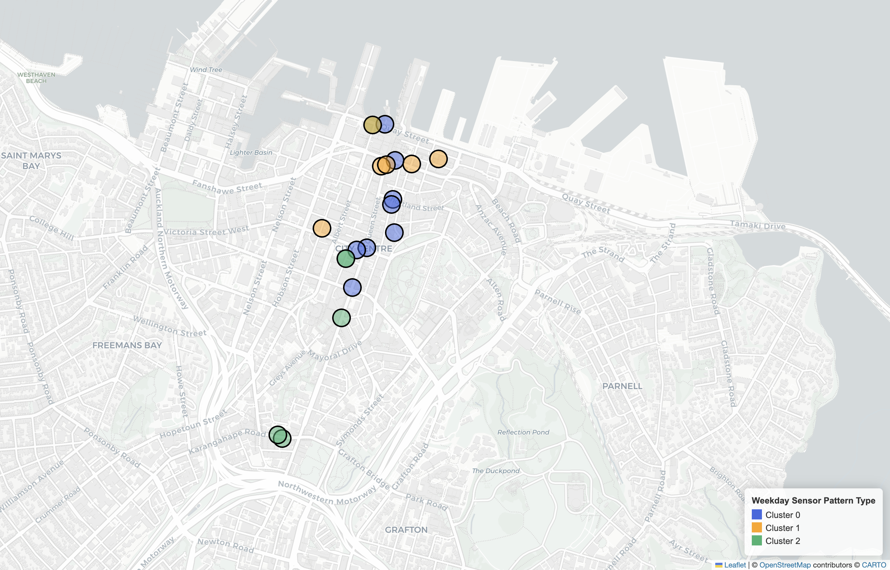

Auckland CBD does not feel like the same place every day of the week. On a weekday, the city centre is shaped by office workers, lunch breaks, commuting, and quick errands between appointments. On a weekend, some of that movement fades, and a different city appears: less tied to work, less uniform across space, and a little less predictable.

I wanted to see how different those two versions of the CBD really are.

Using pedestrian sensor data from across central Auckland, I explored one main question: 

### How does pedestrian activity differ between weekdays and weekends across Auckland CBD, and how do those differences vary by hour, weather, and location?

To answer it, I combined hourly footfall data from Auckland CBD sensors with daily weather data from the Open-Meteo API, then used charts and maps to compare the city’s weekly rhythm.

## Counting footsteps across the city

The main dataset comes from Heart of the City Auckland, the city centre business association, which operates a network of pedestrian sensors across the CBD. Each sensor records how many people walk past in each hour, making it possible to compare both when foot traffic happens and where it is strongest.

### Loading the pedestrian data

```{python}
import pandas as pd
import openmeteo_requests
import requests_cache
from retry_requests import retry
import matplotlib.pyplot as plt
import matplotlib.colors as mcolors
from matplotlib.patches import Patch
import geopandas as gpd
from sklearn.cluster import KMeans
# Load the pedestrian dataset
ped = pd.read_csv('data/akl_ped-2024.csv')
```

### Inspecting and cleaning the data

Like most real-world datasets, it needed cleaning before it could say anything useful. I removed note rows that were not actual observations, fixed an inconsistent sensor name, converted the date column properly, and created time variables such as month, hour, and day of week. I also reshaped the data from a wide format into a long format so that each row represented a single sensor reading at a single time.

That restructuring mattered. It made it much easier to compare movement patterns by sensor, by hour, and by weekday versus weekend.

```{python}
# Fix the typo in one sensor name
ped.rename(columns={"59 High Stret": "59 High Street"}, inplace=True)

# Remove note rows such as "Daylight Savings"
mask = ped['Date'].str.match(r'^\d{4}', na=False)
# Remove non-date rows (e.g. "Daylight Savings")
ped = ped[mask].copy()
```

### Creating time variables

```{python}
# Keep a list of the original sensor columns
sensor_cols = ped.columns[2:]

# Convert Date to datetime
ped["Date"] = pd.to_datetime(ped["Date"])

# Create time variables for analysis
ped["month"] = ped["Date"].dt.month
ped["day_of_week"] = ped["Date"].dt.day_name()
ped["day_num"] = ped["Date"].dt.dayofweek
ped["hour"] = ped["Time"].str.split(":").str[0].astype(int)

# Mark weekends as True
ped["is_weekend"] = ped["day_num"] >= 5
```

### Reshaping the data

```{python}
# Reshape the data from wide format to long format
ped_long = pd.melt(
    ped,
    id_vars=["Date", "Time", "month", "day_of_week", "day_num", "hour", "is_weekend"],
    value_vars=sensor_cols.tolist(),
    var_name="location",
    value_name="count"
)

# After reshaping the 2024 dataset to long format, 
# I inspected the dataframe with info() and found no null values, 
# so no row deletion or imputation was required.
```

### Summary of the cleaned data

The cleaned dataset contains hourly pedestrian observations from 21 sensors across Auckland CBD for the 2024 calendar year. After removing note rows and correcting one inconsistent sensor name, the data was reshaped into long format so each row represented one sensor reading at one time. No missing values remained in the cleaned pedestrian dataset, and the sensor coordinates were later mapped in WGS84 (EPSG:4326).

```{python}
print("Cleaned data shape:", ped_long.shape)
print("Number of sensors:", ped_long["location"].nunique())
print(
    "Date range:", ped_long["Date"].min().date(), "to", ped_long["Date"].max().date()
    )
print("Missing values in count column:", ped_long["count"].isna().sum())

ped_long[["Date", "Time", "location", "count"]].head()
```

## Functions

Before analysing the pedestrian dataset, I created three helper functions to make the workflow more reusable and easier to follow. One function calculates weekday and weekend averages for a given sensor, while the other two normalize hourly sensor profiles for the clustering step.

### Function 1

This first function returns the mean weekday and weekend pedestrian counts for a single sensor. It is useful for comparing how individual locations behave across the week.

```{python}
def get_mean_weekday_weekend_count(df, sensor):
    """Return the mean weekday and weekend pedestrian counts for one sensor.

    Parameters:
        df: DataFrame containing pedestrian count data.
        sensor: Name of the sensor location.

    Returns:
        A tuple with weekday mean and weekend mean.
    """
    # Filter weekday rows for one sensor
    weekdays = df[df["is_weekend"] == False]
    weekdays_mean = weekdays[weekdays["location"] == sensor]["count"].mean()

    # Filter weekend rows for one sensor
    weekends = df[df["is_weekend"]]
    weekends_mean = weekends[weekends["location"] == sensor]["count"].mean()

    return weekdays_mean, weekends_mean
```

### Function 2

This function normalizes a row of hourly values so that the total adds up to 1. It is used to focus on the shape of activity across the day rather than raw pedestrian volume.

```{python}
def normalize(data):
    """Normalize a sequence of values so they add up to 1.

    Parameters:
        data: A row or sequence of numeric values.

    Returns:
        A normalized version of the input data.
    """
    total = data.sum()
    if total == 0:
        return data
    return data / total
```

### Function 3

This final function applies the normalization step to every sensor profile in the hourly matrix. It prepares the data for clustering by making each row comparable.

```{python}
def normalize_sensor_hour_matrix(matrix):
    """Normalize each sensor's hourly profile row by row.

    Parameters:
        matrix: DataFrame where rows are sensors and columns are hourly values.

    Returns:
        A DataFrame with each row normalized to sum to 1.
    """
    normalized_matrix = matrix.apply(normalize, axis=1)
    return normalized_matrix
```

## Adding weather to the story

Pedestrian counts tell you how many people passed a sensor, but not what might have influenced that movement. To add some context, I brought in daily weather data for Auckland CBD using the Open-Meteo Archive API.

I focused mainly on rainfall, then matched each day’s weather records to the corresponding pedestrian counts. For the main weather comparison, I grouped days into two simple categories: wet and dry.

This was not meant to build a full causal model of walking behaviour. It was a way to ask a practical question: does rain change the weekday-weekend pattern, or is the weekly rhythm stronger than the weather effect?

```{python}
# Set up the Open-Meteo API client with caching and retry
cache_session = requests_cache.CachedSession('.cache', expire_after = -1)
retry_session = retry(cache_session, retries = 5, backoff_factor = 0.2)
openmeteo = openmeteo_requests.Client(session = retry_session)

# Set the weather API endpoint
url = "https://archive-api.open-meteo.com/v1/archive"

# Request daily weather data for Auckland CBD
params = {
	"latitude": -36.8485,
	"longitude": 174.7635,
	"start_date": "2024-01-01",
	"end_date": "2024-12-31",
	"daily": ["rain_sum", "weather_code", "temperature_2m_mean"],
	"timezone": "Pacific/Auckland",
}
responses = openmeteo.weather_api(url, params = params)

# Use the first API response
response = responses[0]

# Extract the daily weather variables
daily = response.Daily()
daily_rain_sum = daily.Variables(0).ValuesAsNumpy()
daily_weather_code = daily.Variables(1).ValuesAsNumpy()
daily_temperature_2m_mean = daily.Variables(2).ValuesAsNumpy()

# Build a daily date range to match the weather data
daily_data = {"Date": pd.date_range(
	start = pd.to_datetime(daily.Time() + response.UtcOffsetSeconds(), 
        unit = "s", 
        utc = True),
	end =  pd.to_datetime(daily.TimeEnd() + response.UtcOffsetSeconds(), 
        unit = "s", 
        utc = True),
	freq = pd.Timedelta(seconds = daily.Interval()),
	inclusive = "left"
)}

# Add weather variables to the dictionary
daily_data["rain_sum"] = daily_rain_sum
daily_data["weather_code"] = daily_weather_code
daily_data["temperature_2m_mean"] = daily_temperature_2m_mean

# Convert the weather dictionary into a DataFrame
weather_df = pd.DataFrame(data = daily_data)

# Remove timezone information so Date matches the pedestrian data
weather_df["Date"] = pd.to_datetime(
    weather_df["Date"]
    ).dt.tz_localize(None).dt.normalize()
```

### Merging the API data with pedestrian counts

```{python}
# Merge the weather data into the pedestrian data
df = ped_long.merge(weather_df, on="Date", how="left")
```


## What the data shows

The first thing I wanted to check was whether Auckland CBD is generally busier on weekdays or weekends. To do that, I first split the data into weekday and weekend observations, then compared both the overall average counts and the hourly patterns across the day.

```{python}
# Split the data into weekdays and weekends
weekdays = df[df["is_weekend"] == False]
weekday_mean = weekdays["count"].mean()

weekends = df[df["is_weekend"]]
weekend_mean = weekends["count"].mean()

# Calculate mean hourly counts for weekdays and weekends
weekday_hourly = weekdays.groupby("hour")["count"].mean()
weekend_hourly = weekends.groupby("hour")["count"].mean()
```


It stood out to me how strongly Auckland CBD still behaves like a workweek city.

```{python}
#| fig-cap: "Mean hourly pedestrian counts across Auckland CBD. Weekday activity stays above weekend activity for most of the day, especially during typical working hours."
#| fig-align: center

# Plot weekday and weekend hourly line chart
fig, ax = plt.subplots(figsize=(12, 8))
ax.set_xticks(range(0, 24, 2))
ax.grid(True, alpha=0.3)

# Plot weekday hourly pattern
ax.plot(weekday_hourly.index, 
    weekday_hourly.values, 
    color=mcolors.CSS4_COLORS["seagreen"], 
    marker="o", 
    label="Weekday")

# Plot weekend hourly pattern
ax.plot(weekend_hourly.index, 
    weekend_hourly.values, 
    color=mcolors.CSS4_COLORS["crimson"], 
    marker="o", 
    label = "Weekend")

# Add labels and title
ax.set_xlabel('Hours', fontsize=16)
ax.set_ylabel('Mean pedestrian count', fontsize=16)
ax.set_title('Mean Pedestrian Count by Hour (Auckland CBD)', fontsize=18)
ax.tick_params(axis="both", labelsize=14)
ax.legend(fontsize=16)

plt.tight_layout()
plt.savefig("figures/figure1.png", dpi=300, bbox_inches="tight")
plt.show()
```

Across most hours of the day, weekday foot traffic is higher than weekend foot traffic. The difference is especially clear through the middle of the day and into the late afternoon, which suggests that much of the CBD’s movement is still shaped by workday routines: commuting, office activity, lunch-hour trips, and after-work movement.

But the difference is not just about volume. It is also about rhythm. Weekday activity rises more sharply in the morning and stays stronger through the daytime. Weekend movement is flatter and less structured. In other words, the CBD does not simply get quieter on weekends — it moves to a different schedule.

This shift suggests that the city centre is not just busier during the week, but functionally different across the week.

### Rain changes the picture, but not evenly

The weekly rhythm is the strongest pattern in the data, but I also wanted to see whether rain changes that picture. To test this, I grouped each day into a simple wet or dry category using daily rainfall totals.

```{python}
# Create a simple wet/dry condition from rain_sum
df["condition"] = df["rain_sum"].apply(lambda x: "wet" if x > 0 else "dry")

# Compare counts by weekday/weekend and wet/dry condition
count_by_weekend_and_condition = df.groupby(
    ["is_weekend", "condition"]
    )["count"].mean()
```

```{python}
#| fig-cap: "Average pedestrian counts grouped by day type and rainfall condition. Wet weekdays show a clearer drop than wet weekends."
#| fig-align: center

# Prepare labels for the wet/dry bar chart
categories = ["Dry Weekday", "Wet Weekday", "Dry Weekend", "Wet Weekend"]

# Extract the four grouped means
values = [
    count_by_weekend_and_condition[(False, "dry")],
    count_by_weekend_and_condition[(False, "wet")],
    count_by_weekend_and_condition[(True, "dry")],
    count_by_weekend_and_condition[(True, "wet")]
]

# Set the bar colors
colors = ["mediumseagreen", "seagreen", "lightcoral", "crimson"]

# Plot the wet/dry weekday/weekend bar chart
fig, ax = plt.subplots(figsize=(10, 6))
bars = ax.bar(categories, values, color=colors, alpha=0.7, edgecolor='black')

# Add value labels above the bars
for bar in bars:
    height = bar.get_height()
    ax.text(
        bar.get_x() + bar.get_width() / 2,
        height + 2,
        f"{height:.0f}",
        ha="center",
        va="bottom",
        fontsize=14
    )

# Add labels and title
ax.set_xlabel('Day type', fontsize=16)
ax.set_ylabel('Pedestrian count', fontsize=16)
ax.set_title(
    'Average Pedestrian Count by Day Type and Rain Condition', 
    fontsize=18
)
ax.grid(axis='y', alpha=0.3)
ax.tick_params(axis="both", labelsize=14)
ax.set_ylim(0, 350)

plt.tight_layout()
plt.savefig("figures/figure2.png", dpi=300, bbox_inches="tight")
plt.show()
```

When I compared wet and dry days, weekday pedestrian counts were lower on wet days than on dry days. The same pattern existed on weekends too, but the drop was much smaller.

That suggests weekday walking may be more sensitive to rainfall than weekend walking. One possible explanation is that weekday foot traffic is more closely tied to regular routines. If a rainy day disrupts commuting, office movement, or casual lunchtime walking, that effect can show up strongly in the counts. Weekend movement, while lower overall, may already be less structured, so the relative impact of rain looks smaller.

This does not mean weather matters more than the weekly pattern. The weekday-weekend contrast is still the clearest signal in the data. But rain does appear to nudge weekday activity downward more noticeably.

### Not every part of the CBD behaves the same way

The city-wide pattern is clear, but Auckland CBD is not one uniform walking environment. To see how the weekday-weekend difference varies across space, I calculated separate weekday and weekend averages for each sensor location.

```{python}
# List of all sensor names
sensors = [
    "107 Quay Street",
    "Te Ara Tahuhu Walkway",
    "Commerce Street West",
    "7 Custom Street East",
    "45 Queen Street",
    "30 Queen Street",
    "19 Shortland Street",
    "2 High Street",
    "1 Courthouse Lane",
    "61 Federal Street",
    "59 High Street",
    "210 Queen Street",
    "205 Queen Street",
    "8 Darby Street EW",
    "8 Darby Street NS",
    "261 Queen Street",
    "297 Queen Street",
    "150 K Road",
    "183 K Road",
    "188 Quay Street Lower Albert (EW)",
    "188 Quay Street Lower Albert (NS)"
]
# Store weekday and weekend means for each sensor
sensors_count_dict = {}
for sensor in sensors:
    weekdays_mean, weekends_mean = get_mean_weekday_weekend_count(df, sensor)
    sensors_count_dict[sensor] = {
        "weekdays_mean": weekdays_mean,
        "weekends_mean": weekends_mean
    }

# Convert the dictionary into a DataFrame
sensors_df = pd.DataFrame.from_dict(sensors_count_dict, orient="index")
sensors_df = sensors_df.reset_index()
sensors_df = sensors_df.rename(columns={"index": "location"})

# Calculate weekend mean minus weekday mean
# Positive = busier on weekends
sensors_df["difference"] = sensors_df["weekends_mean"] - sensors_df["weekdays_mean"]

# Sort sensors from most weekend-heavy to most weekday-heavy
weekend_heavy = sensors_df.sort_values("difference", ascending=False)
weekday_heavy = sensors_df.sort_values("difference", ascending=True)
```

```{python}
#| fig-cap: "The largest weekday–weekend differences across Auckland CBD sensors. Negative values indicate sensors that are busier on weekdays than weekends."
#| fig-align: center

# Sort sensors by weekday/weekend difference
sorted_sensors = sensors_df.sort_values(by="difference")

# Select the 5 most weekday-heavy and 5 most weekend-heavy sensors
top5 = sorted_sensors.iloc[:5]
bottom5 = sorted_sensors.iloc[-5:]

selected_sensors = pd.concat([top5, bottom5])
locations = selected_sensors["location"]
differences = selected_sensors["difference"]

# Color negative values green and positive values red
colors = ["seagreen" if x < 0 else "crimson" for x in differences]

# Plot the top/bottom sensor difference chart
fig, ax = plt.subplots(figsize=(12, 9))

bars = ax.barh(locations, differences, color=colors, alpha=0.8, edgecolor="black")

# Add a zero line
ax.axvline(0, color="black", linewidth=1)

# Add value labels beside the bars
for bar in bars:
    width = bar.get_width()
    y = bar.get_y() + bar.get_height() / 2

    if width < 0:
        ax.text(width - 3, y, f"{width:.0f}", ha="right", va="center", fontsize=11)
    else:
        ax.text(width + 3, y, f"{width:.0f}", ha="left", va="center", fontsize=11)

# Add labels and title
ax.set_xlabel("Weekend Mean - Weekday Mean", fontsize=14)
ax.set_ylabel("Sensor Location", fontsize=14)
ax.set_title(
    "Difference in Average Weekend and Weekday Pedestrian Count by Sensor", 
    fontsize=16
)
ax.tick_params(axis="both", labelsize=11)
ax.grid(axis="x", alpha=0.3)

# Add a legend for the bar colors
legend_handles = [
    Patch(facecolor="seagreen", edgecolor="black", label="Higher on weekdays"),
    Patch(facecolor="crimson", edgecolor="black", label="Higher on weekends")
]

ax.legend(handles=legend_handles, fontsize=12, loc="lower right")
ax.set_xlim(-190, 30)

plt.tight_layout()
plt.savefig("figures/figure3.png", dpi=300, bbox_inches="tight")
plt.show()
```

This comparison shows that the weekday-weekend shift is not evenly spread across the CBD. Some sensors are strongly weekday-heavy, while others show much smaller differences. That suggests different parts of the city centre depend on different kinds of movement, and not every location is equally tied to weekday routines.

### Geospatial visualisation


Instead of treating the CBD as one block, the map shows it as a set of places with different weekly rhythms. Some sensors remain strongly weekday-oriented, while others retain relatively stronger weekend activity. That reinforces a simple but important point: Auckland CBD is not one single pedestrian landscape. It is a mix of places used differently across the week.

```{python}
# Load the sensor coordinate file
ped_geodata = pd.read_csv('data/akl_ped-Geodata.csv')

# Keep only rows with valid coordinates
ped_geodata = ped_geodata.dropna(subset=["Latitude", "Longitude"]).copy()

# Merge the sensor summary data with the coordinates
sensors_df_geo = sensors_df.merge(
    ped_geodata, 
    left_on="location", 
    right_on="Address", 
    how="inner"
)

# Convert the table into a GeoDataFrame
gdf = gpd.GeoDataFrame(
    sensors_df_geo,
    geometry=gpd.points_from_xy(
        sensors_df_geo["Longitude"], sensors_df_geo["Latitude"]
),
    crs="EPSG:4326"
)

# Create labels and rounded values for the map tooltip
gdf["pattern"] = gdf["difference"].apply(
    lambda x: "Higher on weekdays" if x < 0 else "Higher on weekends"
)
gdf["weekdays_mean_rounded"] = gdf["weekdays_mean"].round(0)
gdf["weekends_mean_rounded"] = gdf["weekends_mean"].round(0)
gdf["difference_rounded"] = gdf["difference"].round(0)

# Build the interactive map
m = gdf.explore(
    column="pattern",
    categorical=True,
    cmap=["seagreen", "crimson"],
    categories=["Higher on weekdays", "Higher on weekends"],
    tooltip=[
        "location",
        "weekdays_mean_rounded",
        "weekends_mean_rounded",
        "difference_rounded"
    ],
    tooltip_kwds={
        "aliases": ["Sensor", "Weekday Mean", "Weekend Mean", "Weekend - Weekday"]
    },
    tiles="CartoDB positron",
    marker_kwds={"radius": 12, "fillOpacity": 0.9},
    legend=True,
    legend_kwds={"caption": "Pedestrian Activity Pattern"},
    style_kwds={"weight": 2, "color": "black", "opacity": 1},
)

# Save the map as an HTML file
m.save("sensor_map.html")
```


### Different weekday rhythms inside the CBD

To push the analysis a little further, I looked only at weekdays and grouped sensors by the shape of their hourly pattern using KMeans. Instead of clustering sensors by how large their counts were, I normalized each sensor’s weekday profile so the clustering focused on rhythm rather than total volume.


```{python}
# Calculate mean weekday count for each sensor and hour
mean_count_per_hour = weekdays.groupby(["location", "hour"])["count"].mean()

# Reshape so rows are sensors and columns are hours
sensor_hour_matrix = mean_count_per_hour.unstack()

# Normalize each sensor profile so clustering focuses on shape, not size
sensor_hour_normalized = normalize_sensor_hour_matrix(sensor_hour_matrix)

# Group sensors into 3 clusters
kmeans = KMeans(n_clusters=3, random_state=42)
cluster_labels = kmeans.fit_predict(sensor_hour_normalized)

# Save the cluster label for each sensor
cluster_df = pd.DataFrame({
    "location": sensor_hour_normalized.index,
    "cluster": cluster_labels
})

# Add cluster labels back onto the normalized matrix
cluster_matrix = sensor_hour_normalized.copy()
cluster_matrix = cluster_matrix.reset_index()
cluster_matrix = cluster_matrix.rename(columns={"index": "location"})

cluster_matrix = cluster_matrix.merge(cluster_df, on="location", how="left")

# Calculate the average normalized profile for each cluster
cluster_profiles = cluster_matrix.groupby("cluster").mean(numeric_only=True)
```

```{python}
#| fig-cap: "Average normalized weekday hourly profiles by sensor cluster. The clusters suggest that different parts of the CBD follow different weekday rhythms."
#| fig-align: center

# Plot the cluster profiles
fig, ax = plt.subplots(figsize=(12, 8))

for cluster in cluster_profiles.index:
    ax.plot(
        cluster_profiles.columns,
        cluster_profiles.loc[cluster],
        marker="o",
        label=f"Cluster {cluster}"
    )

# Add labels and title
ax.set_xticks(range(0, 24, 2))
ax.set_xlabel("Hour of Day", fontsize=14)
ax.set_ylabel("Normalized Share of Weekday Activity", fontsize=14)
ax.set_title("Average Weekday Hourly Profiles by Sensor Cluster", fontsize=16)
ax.tick_params(axis="both", labelsize=12)
ax.grid(True, alpha=0.3)
ax.legend(fontsize=12)

plt.tight_layout()
plt.savefig("figures/figure4.png", dpi=300, bbox_inches="tight")
plt.show()
```

The clustering suggests that even weekdays do not follow one single CBD pattern. Cluster 1 looks the most commuter-like, with the clearest rush-hour pattern. Cluster 0 is more midday-focused, while Cluster 2 has a broader spread across the day and evening. These labels are only interpretations of the shapes in the data, not exact land-use categories, but they still show that weekday movement in the CBD is not uniform.

The map makes this pattern easier to understand. Instead of only showing that different weekday rhythms exist, it shows where those rhythms appear across the CBD.

### Cluster map



Together, the cluster profile chart and the map suggest that the weekday city is not one single pedestrian system. Even within the workweek, different parts of Auckland CBD move to slightly different rhythms.

```{python}
# Join cluster labels onto the map GeoDataFrame
gdf_cluster = gdf.merge(cluster_df, on="location", how="left")

# Give each cluster a display name
gdf_cluster["cluster_name"] = gdf_cluster["cluster"].map({
    0: "Cluster 0",
    1: "Cluster 1",
    2: "Cluster 2"
})

# Round values for cleaner tooltips
gdf_cluster["weekdays_mean_rounded"] = gdf_cluster["weekdays_mean"].round(0)
gdf_cluster["weekends_mean_rounded"] = gdf_cluster["weekends_mean"].round(0)
gdf_cluster["difference_rounded"] = gdf_cluster["difference"].round(0)

# Build the interactive cluster map
cluster_map = gdf_cluster.explore(
    column="cluster_name",
    categorical=True,
    cmap=["royalblue", "orange", "mediumseagreen"],
    categories=["Cluster 0", "Cluster 1", "Cluster 2"],
    tooltip=[
        "location",
        "cluster_name",
        "weekdays_mean_rounded",
        "weekends_mean_rounded",
        "difference_rounded"
    ],
    tooltip_kwds={
        "aliases": [
            "Sensor",
            "Cluster Type",
            "Weekday Mean",
            "Weekend Mean",
            "Weekend - Weekday"
        ]
    },
    tiles="CartoDB positron",
    marker_kwds={"radius": 12, "fillOpacity": 1},
    legend=True,
    legend_kwds={"caption": "Weekday Sensor Pattern Type"},
    style_kwds={"weight": 2, "color": "black", "opacity": 1},
)

# Save the cluster map as an HTML file
cluster_map.save("sensor_cluster_map.html")
```

## What this does not tell us

A few caveats matter here.

First, the weather data was daily rather than hourly, so a “wet” day could still include dry periods when people were walking normally. Hourly weather data would sharpen that comparison considerably.

Second, the sensors count people at fixed locations, not whole journeys. They show where people passed, but not where they came from, where they were going, or why they were there.

Third, the map shows point locations rather than true pedestrian catchment areas. It is useful for showing spatial patterns, but it should not be read as a full model of how walking is distributed across the entire CBD.

Finally, the clustering is exploratory. It is a helpful way to identify similar weekday movement shapes, but the labels I give those clusters are interpretive, not definitive.


## So what?

Even with those limitations, the pattern is still meaningful.

Auckland CBD does not simply become quieter on weekends. Its rhythm changes. Weekday movement is stronger and more tied to regular routines, while weekend activity is lower and less evenly spread across the city. Some locations remain relatively active, while others rely much more heavily on weekday traffic.

That matters because it shows the CBD is not one uniform space. It is a mix of places used differently across the week. For retailers, transport operators, and city planners, that distinction matters. A city centre that depends heavily on weekday routines behaves differently from one with more evenly distributed weekly activity.

In that sense, Auckland CBD really does behave like two cities in one.

## Reproducibility

All code, data, and outputs for this project are available in the public GitHub repository below.

GitHub repository:
https://github.com/Zhengyi-Yan/GISCI343_Assignment_1

The repository includes:

- the Quarto document used to generate this report
- the cleaned workflow in Python
- the data files
- the interactive map outputs used in the analysis

## Data Sources / References

Heart of the City pedestrian counts

Open-Meteo API